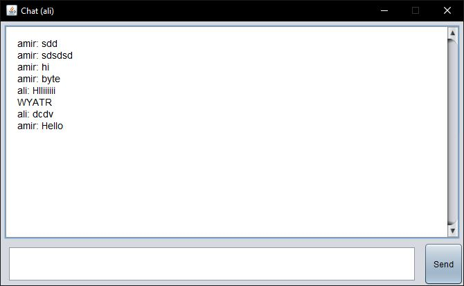

# Cryptography Programming Project

**⚠️ Note: The sample solution has been removed from this repository at the request of the course team, as it will be reused in subsequent semesters.**

This repository contains the materials for a cryptography programming project designed as part of a course. The project involves implementing various cryptographic algorithms and systems within a federated messaging application, inspired by the security architecture and protocols used in [Telegram](https://telegram.org/).

## Project Overview

The project is designed to give students hands-on experience with real-world cryptographic systems by implementing several key algorithms and integrating them into a functional messaging application. The project is divided into multiple components, each focusing on a different aspect of cryptography and secure communication.

### Key Objectives

- **Cryptographic Implementations**: Students will implement crucial cryptographic algorithms, including:

  - **RSA Public Key Encryption System**: For secure key exchange and message encryption.
  - **AES256 Symmetric Encryption System**: For high-speed, secure message encryption.
  - **Diffie–Hellman Key Exchange Protocol**: For securely exchanging cryptographic keys over a public channel.
  - **RC4 Pseudo-Random Number Generator**: For generating cryptographically secure random numbers.
  - **SHA256 Hash Function**: For generating secure message digests.

- **Network and Communication Protocols**: The project involves integrating the cryptographic algorithms into an existing network and communication framework. Most of the network and protocol-related work, such as managing client-server communication, handling connections, and ensuring the secure transmission of data, has already been implemented and provided. Students are responsible for integrating their cryptographic implementations into this framework to ensure secure communication between users and the server.

- **Graphical User Interface (GUI)**: The project includes a pre-built GUI developed in Java. This interface allows users to interact with the messaging application, send and receive messages, and manage their contacts. The GUI serves as the front-end of the application, making the cryptographic processes transparent to the user.

### Screenshots

Here are some screenshots of the application's interface:

<table>
  <tr>
    <td align="center">
      
      
Login Page

    </td>
    <td align="center">
      
      
Contacts Page

    </td>
    <td align="center">
      
      
Chat Screen

    </td>
  </tr>
</table>

### Initial Codes

The repository provides the base code necessary to start the project. This includes:

- **Network Handling**: Pre-built Java classes that manage client-server communication, including connection establishment and data and messaging protocols.
- **Graphical User Interface (GUI)**: A fully functional GUI developed in Java, allowing users to interact with the messaging application, manage contacts, and exchange messages securely.
- **Core Structure**: Initial setups such as class definitions and methods that students will extend with their cryptographic implementations.

The goal is to help students focus on implementing and integrating cryptographic algorithms rather than building the network and UI layers from scratch.

## Project Structure

The repository includes the following files and directories:

- **readme.md**: This file, containing information about the project and instructions.
- **project-en.pdf**: The English version of the project documentation. This version was translated using ChatGPT from the original Persian document.
- **project-fa.pdf**: The original Persian version of the project documentation.
- **initial-codes/**: A directory containing the initial code provided to students as the starting point for the project. This includes the network layer, GUI, and other foundational elements that students will build upon.
- **sample-solution/**: A directory that would have contained a sample solution but has been removed as per the course team's request.

### Sample Solution

The `sample-solution` directory originally contained a reference implementation. This solution demonstrated how to:

- Implement the cryptographic algorithms required for the project.
- Integrate these algorithms into the provided network and GUI layers.
- Ensure the application is fully functional, secure, and adheres to the project specifications.

However, the solution has been removed from this repository to preserve its use for future course iterations.

## Project Documentation

- **project-en.pdf**: The English version of the project documentation, translated using ChatGPT. This document provides detailed instructions on the project's objectives, requirements, and guidelines for implementation.
- **project-fa.pdf**: The original Persian version of the project documentation. This document was initially used in the course and contains the same information as the English version.

## License

This project is licensed under the **Creative Commons Attribution-NonCommercial 4.0 International (CC BY-NC 4.0)** license.

## Acknowledgments

- The original project documentation was written in Persian.
- The English translation was performed using ChatGPT.
- The project design was inspired by the secure messaging architecture of Telegram.
